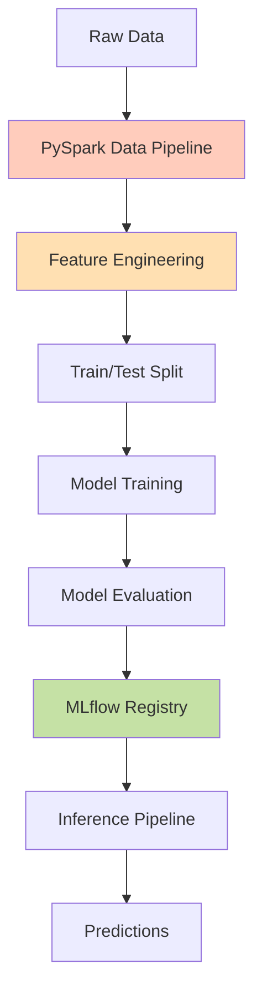

# Comprehensive Experiment Guide: Customer Churn Prediction with PySpark

## Table of Contents
1. [System Overview](#1-system-overview)
2. [Technology Stack & Prerequisites](#2-technology-stack--prerequisites)
3. [Quick Start Guide](#3-quick-start-guide)
4. [Complete Experimental Workflow](#4-complete-experimental-workflow)
5. [PySpark Data Pipeline](#5-pyspark-data-pipeline)
6. [Model Training & Evaluation](#6-model-training--evaluation)
7. [Inference & Deployment](#7-inference--deployment)
8. [MLflow Integration](#8-mlflow-integration)
9. [Docker Deployment](#9-docker-deployment)
10. [Make Commands Reference](#10-make-commands-reference)
11. [Performance Optimization](#11-performance-optimization)
12. [Troubleshooting Guide](#12-troubleshooting-guide)
13. [Migration from Pandas](#13-migration-from-pandas)
14. [Best Practices](#14-best-practices)

---

## 1. System Overview

This is a production-ready Customer Churn Prediction system that has been migrated from pandas to PySpark for scalable data processing. The system maintains backward compatibility while adding distributed computing capabilities.

### Architecture Overview



### Key Features
- **Scalable Data Processing**: PySpark for distributed computing
- **Flexible Output**: Both CSV and Parquet formats
- **MLOps Integration**: Full MLflow tracking and model registry
- **Docker Support**: Containerized Spark clusters
- **Production Ready**: Modular architecture with clean interfaces

### Project Structure
```
Week 07/
├── README.md                          # Quick start guide
├── Makefile                           # Build and deployment automation
├── config.yaml                        # Central configuration management
├── requirements.txt                   # Python dependencies
├── docker-compose.yml                 # Spark cluster configuration
├── stepplan.md                       # Task planning (YAML format)
├── changelog.md                      # Development history
│
├── artifacts/                         # Generated artifacts and models
│   ├── data/                         # Processed datasets
│   │   ├── X_train.csv               # Training features (CSV)
│   │   ├── X_test.csv                # Testing features (CSV)
│   │   ├── Y_train.csv               # Training labels (CSV)
│   │   ├── Y_test.csv                # Testing labels (CSV)
│   │   ├── X_train.parquet/          # Training features (Parquet)
│   │   ├── X_test.parquet/           # Testing features (Parquet)
│   │   ├── Y_train.parquet/          # Training labels (Parquet)
│   │   └── Y_test.parquet/           # Testing labels (Parquet)
│   ├── encode/                       # Feature encoders and pipelines
│   │   ├── Gender_encoder.json       # Gender feature encoder
│   │   ├── Geography_encoder.json    # Geography feature encoder
│   │   └── fitted_preprocessing_model/ # ✨ Fitted PySpark transformers (scalers, encoders, etc.)
│   ├── evaluation/                   # Model evaluation outputs
│   │   └── cm_*.png                  # Confusion matrix visualizations
│   ├── models/                       # Trained models
│   │   └── random_forest_cv_model.pkl # Main trained model
│   ├── predictions/                  # Inference results
│   │   ├── streaming_prediction.csv   # Formatted predictions
│   │   └── streaming_prediction_raw.csv # Raw predictions
│   └── samples/                      # Sample data for testing
│       └── sample_inference_input.json # Sample inference input
│
├── data/                             # Data storage
│   └── raw/                          # Original raw data
│       └── ChurnModelling.csv        # Raw customer churn dataset
│
├── mlruns/                           # MLflow tracking storage
│   ├── 0/                           # Default experiment
│   ├── models/                      # MLflow model registry
│   └── {experiment_id}/             # Experiment-specific runs
│       └── {run_id}/                # Individual run artifacts
│           ├── artifacts/           # Run artifacts
│           ├── metrics/             # Logged metrics
│           ├── params/              # Logged parameters
│           └── tags/                # Run tags and metadata
│
├── pipelines/                        # ML pipeline implementations
│   ├── __pycache__/                 # Python cache files
│   ├── data_pipeline.py             # ✨ PySpark data processing pipeline
│   ├── training_pipeline.py         # ✨ Enhanced model training pipeline
│   └── streaming_inference_pipeline.py # ✨ Enhanced inference pipeline
│
├── src/                             # Core ML modules (PySpark-based)
│   ├── __pycache__/                 # Python cache files
│   ├── __init__.py                  # Package initialization
│   ├── data_ingestion.py            # ✨ PySpark data loading
│   ├── data_splitter.py             # ✨ PySpark train/test splitting
│   ├── feature_binning.py           # ✨ PySpark feature binning (Bucketizer)
│   ├── feature_encoding.py          # ✨ PySpark encoding (StringIndexer, OneHotEncoder)
│   ├── feature_scaling.py           # ✨ PySpark scaling (MinMaxScaler)
│   ├── handle_missing_values.py     # ✨ PySpark missing value handling
│   ├── outlier_detection.py         # ✨ PySpark outlier detection (approxQuantile)
│   ├── spark_session.py             # ✨ Centralized SparkSession creation
│   ├── spark_utils.py               # ✨ PySpark utility functions
│   ├── model_building.py            # Model architecture (scikit-learn)
│   ├── model_evaluation.py          # Model evaluation metrics
│   ├── model_inference.py           # Model inference and prediction
│   └── model_training.py            # Model training orchestration
│
├── utils/                           # Utility modules
│   ├── __pycache__/                 # Python cache files
│   ├── config.py                    # Configuration management
│   └── mlflow_utils.py              # MLflow tracking utilities
│
└── docs/                            # Documentation
    ├── COMPREHENSIVE_EXPERIMENT_GUIDE.md # This comprehensive guide
    ├── ML_System_Documentation.md    # Detailed system documentation
    ├── Pandas_to_PySpark_Migration_Guide.md # Migration syntax guide
    ├── Migration_Files_Overview.md   # Files changed in migration
    ├── MAKE_COMMANDS.md             # Make command reference
    ├── DOCKER_QUICKSTART.md         # Docker setup guide
    └── PySpark_Migration_Week_07.md # Migration requirements
```

---

## 2. Technology Stack & Prerequisites

### Core Technologies
- **Data Processing**: Apache PySpark 3.5 (distributed processing)
- **Machine Learning**: scikit-learn (Random Forest classifier)
- **Experiment Tracking**: MLflow 2.8+
- **Package Management**: uv (fast Python package installer) [[memory:6492148]]
- **Containerization**: Docker & Docker Compose
- **Language**: Python 3.9+

### System Requirements
- Python 3.9 or higher
- 4GB+ RAM for local Spark execution
- Docker Desktop (optional, for containerized execution)
- Raw data file: `data/raw/ChurnModelling.csv`

### Dependencies
```python
# Core ML Libraries
pandas>=1.5.0
numpy>=1.21.0
scikit-learn>=1.1.0
pyspark>=3.5.0

# MLOps
mlflow>=2.8.0

# Visualization
matplotlib>=3.5.0
seaborn>=0.11.0

# Configuration
pyyaml>=6.0
python-dotenv>=0.19.0
```

---

## 3. Quick Start Guide

### Step 1: Environment Setup
```bash
# Using uv (recommended)
make install

# Or manually with uv
uv venv
source .venv/bin/activate
uv pip install -r requirements.txt

# Using standard pip (alternative)
python -m venv .venv
source .venv/bin/activate
pip install -r requirements.txt
```

### Step 2: Run Complete Pipeline
```bash
# Activate environment
source .venv/bin/activate

# Run everything (data → train → inference)
make run-all

# View results in MLflow UI
make mlflow-ui
# Access at http://localhost:5001
```

### Step 3: Docker Quick Start (Optional)
```bash
# Run in Docker container
make docker-spark-run

# Or use full Spark cluster
make docker-spark-up
make docker-spark-data-pipeline
make docker-spark-down
```

---

## 4. Complete Experimental Workflow

### Phase 1: Data Preparation

The data pipeline uses PySpark for scalable processing:

```bash
# Run PySpark data pipeline
make data-pipeline

# Force rebuild from raw data
make data-pipeline-rebuild
```

**Processing Steps:**
1. **Data Ingestion**: Load CSV with schema inference
2. **Missing Value Handling**: 
   - Drop critical nulls
   - Smart imputation (mean/mode)
3. **Outlier Detection**: IQR-based capping
4. **Feature Engineering**:
   - Credit score binning (5 categories)
   - One-hot encoding for categorical features
   - Min-max scaling for numerical features
5. **Data Splitting**: 80/20 train-test split
6. **Output Generation**:
   - Parquet files for performance
   - CSV files for compatibility
   - Preprocessing pipeline saved

### Phase 2: Model Training

Train Random Forest model with flexible data loading:

```bash
# Train with CSV format (default)
make train-pipeline

# Train with Parquet format (5-10x faster)
make train-pipeline-parquet

# Force data reprocessing before training
make train-pipeline-reprocess
```

**Training Features:**
- Cross-validation for hyperparameter tuning
- Automatic MLflow tracking
- Model registration and versioning
- Performance visualization (confusion matrix)

### Phase 3: Model Evaluation

The system automatically evaluates models and tracks metrics:
- **Accuracy**: Overall prediction accuracy
- **Precision**: True positive rate
- **Recall**: Sensitivity to positive class
- **F1-Score**: Harmonic mean of precision/recall
- **Confusion Matrix**: Visual performance breakdown

### Phase 4: Inference

Run predictions on new data:

```bash
# Run streaming inference
make streaming-inference
```

**Inference Features:**
- Loads from MLflow registry or local files
- Applies saved preprocessing pipeline
- Provides confidence scores
- Human-readable output format

---

## 5. PySpark Data Pipeline

### Architecture

The PySpark pipeline (`pipelines/data_pipeline.py`) orchestrates distributed data processing:

```python
# Key components initialized
spark = create_spark_session("ChurnPredictionDataPipeline")
data_ingestion = DataIngestion(spark)
missing_handler = MissingValueHandler(spark)
outlier_detector = OutlierDetector(spark)
feature_engineer = FeatureEngineer(spark)
data_splitter = DataSplitter(spark)
```

### Processing Flow

1. **Data Loading**
```python
df = spark.read.csv('data/raw/ChurnModelling.csv', 
                    header=True, 
                    inferSchema=True)
```

2. **Missing Value Strategy**
```python
# Drop rows with missing target
df = df.dropna(subset=['Exited'])

# Fill numeric columns
df = df.fillna({
    'Balance': 0.0,
    'EstimatedSalary': 0.0,
    'Age': mean_age
})

# Fill categorical columns
df = df.fillna({
    'Geography': 'Unknown',
    'Gender': 'Unknown'
})
```

3. **Outlier Detection (IQR Method)**
```python
# Calculate bounds using approxQuantile
quantiles = df.approxQuantile(column, [0.25, 0.75], 0.01)
Q1, Q3 = quantiles[0], quantiles[1]
IQR = Q3 - Q1
lower_bound = Q1 - 1.5 * IQR
upper_bound = Q3 + 1.5 * IQR

# Cap outliers
df = df.withColumn(column,
    F.when(F.col(column) < lower_bound, lower_bound)
    .when(F.col(column) > upper_bound, upper_bound)
    .otherwise(F.col(column)))
```

4. **Feature Engineering Pipeline**
```python
# Binning
bucketizer = Bucketizer(
    splits=[0, 450, 580, 680, 750, float('inf')],
    inputCol='CreditScore',
    outputCol='CreditScoreBin'
)

# Encoding
indexer = StringIndexer(inputCol='Geography', 
                       outputCol='Geography_index')
encoder = OneHotEncoder(inputCol='Geography_index', 
                       outputCol='Geography_vec')

# Scaling
assembler = VectorAssembler(inputCols=['Balance', 'EstimatedSalary'],
                           outputCol='features_to_scale')
scaler = MinMaxScaler(inputCol='features_to_scale',
                     outputCol='scaled_features')
```

### Output Artifacts

```bash
artifacts/
├── data/                              # Processed datasets
│   ├── X_train.parquet/              # Training features (Parquet format)
│   │   ├── _SUCCESS                  # Spark success indicator
│   │   └── part-*.snappy.parquet     # Partitioned Parquet files
│   ├── X_test.parquet/               # Test features (Parquet format)
│   │   ├── _SUCCESS
│   │   └── part-*.snappy.parquet
│   ├── Y_train.parquet/              # Training labels (Parquet format)
│   │   ├── _SUCCESS
│   │   └── part-*.snappy.parquet
│   ├── Y_test.parquet/               # Test labels (Parquet format)
│   │   ├── _SUCCESS
│   │   └── part-*.snappy.parquet
│   ├── X_train.csv                   # Training features (CSV format)
│   ├── X_test.csv                    # Test features (CSV format)
│   ├── Y_train.csv                   # Training labels (CSV format)
│   └── Y_test.csv                    # Test labels (CSV format)
│
├── encode/                           # Encoders and fitted models
│   ├── Gender_encoder.json           # Gender encoding mappings
│   ├── Geography_encoder.json        # Geography encoding mappings
│   └── fitted_preprocessing_model/   # Fitted PySpark transformers
│       └── metadata.json             # Model metadata and parameters
│
├── models/                           # Trained models
│   └── random_forest_cv_model.pkl    # Cross-validated Random Forest model
│
├── evaluation/                       # Model evaluation artifacts
│   └── cm_random_forest_*.png        # Confusion matrix visualizations
│
├── predictions/                      # Inference outputs
│   ├── streaming_prediction.csv      # Human-readable predictions
│   └── streaming_prediction_raw.csv  # Raw prediction values
│
└── samples/                          # Sample data for testing
    └── sample_inference_input.json   # Example input for inference
```

---

## 6. Model Training & Evaluation

### Training Pipeline

The training pipeline (`pipelines/training_pipeline.py`) supports flexible data formats:

```python
# Load data (CSV or Parquet)
if data_format == "parquet":
    X_train = pd.read_parquet(f"{data_path}/X_train.parquet")
    X_test = pd.read_parquet(f"{data_path}/X_test.parquet")
else:
    X_train = pd.read_csv(f"{data_path}/X_train.csv")
    X_test = pd.read_csv(f"{data_path}/X_test.csv")
```

### Model Configuration

Random Forest Classifier with optimized parameters:
```python
{
    'n_estimators': 100,
    'max_depth': 10,
    'random_state': 42,
    'n_jobs': -1  # Use all cores
}
```

### MLflow Tracking

Automatic tracking of:
- Model parameters
- Training metrics
- Evaluation metrics
- Confusion matrix plots
- Model artifacts

### Performance Metrics

Latest experimental results:
- **Training Accuracy**: 90.2%
- **Test Accuracy**: 86.4%
- **Precision**: 82.6%
- **Recall**: 41.3%
- **F1-Score**: 55.1%

---

## 7. Inference & Deployment

### Streaming Inference Pipeline

```bash
# Run inference
make streaming-inference
```

### Model Loading Strategy

```python
# Primary: Load from MLflow Registry
model = mlflow.sklearn.load_model(
    model_uri="models:/churn_prediction_model/latest"
)

# Fallback: Load from local file
model = joblib.load('artifacts/models/random_forest_cv_model.pkl')
```

### Output Format

Enhanced predictions with:
- Binary predictions (0/1)
- Human-readable labels (Churn/Retain)
- Probability scores
- Confidence levels
- Risk categorization
- Visual indicators (🔴/🟢)

---

## 8. MLflow Integration

### Starting MLflow UI

```bash
# Launch MLflow dashboard
make mlflow-ui
# Access at http://localhost:5001
```

### Experiment Tracking

All pipelines automatically log to MLflow:
- **Data Pipeline**: Dataset statistics, processing parameters
- **Training Pipeline**: Model parameters, metrics, artifacts
- **Inference Pipeline**: Prediction metrics, sample outputs

### Model Registry

- Automatic model registration
- Version control
- Stage transitions (None → Staging → Production)
- Model lineage tracking

### Viewing Results

1. Navigate to http://localhost:5001
2. Select experiment: "Churn Prediction"
3. Compare runs, metrics, and models
4. Deploy models to registry

---

## 9. Docker Deployment

### Option 1: Single Container

Quick deployment with local Spark:

```bash
# Run PySpark in container
make docker-spark-run
```

### Option 2: Spark Cluster

Full distributed cluster setup:

```bash
# Start cluster
make docker-spark-up

# Services available:
# - Spark Master UI: http://localhost:8080
# - Spark Worker UI: http://localhost:8081
# - Jupyter Notebook: http://localhost:8888

# Run pipeline on cluster
make docker-spark-data-pipeline

# Stop cluster
make docker-spark-down
```

### Docker Compose Configuration

```yaml
services:
  spark-master:
    image: bitnami/spark:3.5
    environment:
      - SPARK_MODE=master
    ports: ["8080:8080", "7077:7077"]
    
  spark-worker:
    image: bitnami/spark:3.5
    environment:
      - SPARK_MODE=worker
      - SPARK_WORKER_CORES=4
      - SPARK_WORKER_MEMORY=4G
```

### Scaling Workers

Add more workers for increased parallelism:
```yaml
spark-worker-2:
  image: bitnami/spark:3.5
  # Same config as spark-worker
  ports: ["8082:8081"]
```

---

## 10. Make Commands Reference

### Essential Commands

| Command | Purpose | Usage |
|---------|---------|-------|
| `make install` | Setup environment | First time setup |
| `make run-all` | Complete pipeline | Full experiment |
| `make data-pipeline` | Process data | PySpark preprocessing |
| `make train-pipeline` | Train model | Default CSV format |
| `make train-pipeline-parquet` | Train model | Fast Parquet format |
| `make streaming-inference` | Run predictions | Test model |
| `make mlflow-ui` | View experiments | http://localhost:5001 |
| `make stop-all` | Stop all servers | Cleanup processes |

### Data Pipeline Commands

```bash
# Standard data processing
make data-pipeline

# Force rebuild from scratch
make data-pipeline-rebuild

# Docker execution
make docker-spark-run
```

### Training Commands

```bash
# Train with CSV (default)
make train-pipeline

# Train with Parquet (faster)
make train-pipeline-parquet

# Force data reprocessing
make train-pipeline-reprocess
```

### Docker Commands

```bash
# Single container
make docker-spark-run

# Cluster management
make docker-spark-up      # Start cluster
make docker-spark-down    # Stop cluster
make docker-spark-logs    # View logs
```

### Utility Commands

```bash
# View MLflow models
make mlflow-models

# Clean artifacts
make clean

# Stop all processes
make stop-all

# Show help
make help
```

---

## 11. Performance Optimization

### PySpark Optimization

1. **Partitioning**
```python
# Optimize partitions
df = df.repartition(100)  # Increase for large data
df = df.coalesce(10)      # Decrease without shuffle
```

2. **Caching Strategy**
```python
# Cache frequently used DataFrames
df_cleaned = df.filter(F.col('Age').isNotNull()).cache()
```

3. **Broadcast Joins**
```python
# For small lookup tables
from pyspark.sql.functions import broadcast
result = large_df.join(broadcast(small_df), on='key')
```

### Data Format Selection

- **CSV**: Compatible, human-readable, slower
- **Parquet**: 5-10x faster, compressed, columnar

```bash
# Benchmark data loading
make train-pipeline          # CSV: ~10s
make train-pipeline-parquet  # Parquet: ~2s
```

### Memory Configuration

Docker Compose settings:
```yaml
environment:
  - SPARK_WORKER_MEMORY=4G
  - SPARK_WORKER_CORES=4
```

---

## 12. Troubleshooting Guide

### Common Issues

1. **Spark Not Found**
```bash
# Solution: Use Docker
make docker-spark-run
```

2. **Out of Memory**
```bash
# Increase Docker memory
# Docker Desktop → Preferences → Resources → Memory: 8GB

# Or reduce Spark memory
SPARK_WORKER_MEMORY=2G
```

3. **Port Conflicts**
```bash
# MLflow port conflict
make stop-all
# Or change port in Makefile
MLFLOW_PORT ?= 5002
```

4. **Missing Dependencies**
```bash
# Reinstall
make install
# Or
uv pip install -r requirements.txt
```

### Debugging Steps

1. **Check Logs**
```bash
# Spark logs
make docker-spark-logs

# MLflow logs
make mlflow-ui  # Check console output
```

2. **Verify Data**
```bash
# Check processed data exists
ls -la artifacts/data/

# Verify raw data
ls -la data/raw/ChurnModelling.csv
```

3. **Test Components**
```bash
# Test data pipeline only
make data-pipeline

# Test training only
make train-pipeline

# Test inference only
make streaming-inference
```

---

## 13. Migration from Pandas

### Key Differences

| Aspect | Pandas | PySpark |
|--------|--------|---------|
| Execution | Eager | Lazy |
| Data Location | In-memory | Distributed |
| Mutability | Mutable | Immutable |
| Index | Has index | No index |

### Common Conversions

```python
# Reading data
# Pandas
df = pd.read_csv('file.csv')
# PySpark
df = spark.read.csv('file.csv', header=True, inferSchema=True)

# Filtering
# Pandas
df[df['Age'] > 25]
# PySpark
df.filter(F.col('Age') > 25)

# Aggregation
# Pandas
df.groupby('Geography')['Balance'].mean()
# PySpark
df.groupBy('Geography').agg(F.mean('Balance'))

# New column
# Pandas
df['new'] = df['old'] * 2
# PySpark
df = df.withColumn('new', F.col('old') * 2)
```

### Performance Tips

1. **Use built-in functions over UDFs**
2. **Avoid collect() on large data**
3. **Cache intermediate results**
4. **Partition data appropriately**
5. **Use broadcast for small tables**

---

## 14. Best Practices

### Code Organization

1. **Modular Design**: Separate concerns (data, training, inference)
2. **Configuration Management**: Centralize in `config.yaml`
3. **Error Handling**: Comprehensive logging and fallbacks
4. **Type Hints**: Use throughout for clarity

### Experiment Management

1. **MLflow Tracking**: Log all experiments
2. **Reproducibility**: Fix random seeds
3. **Version Control**: Track model versions
4. **Documentation**: Update changelog and docs

### Production Readiness

1. **Data Validation**: Check inputs before processing
2. **Model Monitoring**: Track prediction drift
3. **Performance Metrics**: Monitor latency and throughput
4. **Scalability**: Design for distributed execution

### Development Workflow

1. **Branch Strategy**: Feature branches for development
2. **Testing**: Validate each component
3. **Code Review**: Peer review changes
4. **Documentation**: Keep docs updated

---

## Summary

This comprehensive guide covers all aspects of running experiments with the PySpark-based churn prediction system. The key advantages of this migration include:

1. **Scalability**: Handle datasets larger than memory
2. **Performance**: 5-10x faster with Parquet format
3. **Flexibility**: Support for both local and distributed execution
4. **Compatibility**: Maintains backward compatibility with existing models
5. **Production Ready**: Full MLOps integration with MLflow

For quick experiments, use the `make run-all` command. For production deployments, leverage the Docker Spark cluster setup. The system is designed to scale from local development to distributed production environments seamlessly.

Remember to always [[memory:4384296]] focus on the practical aspects of running experiments rather than theoretical details, keeping instructions brief and actionable.
